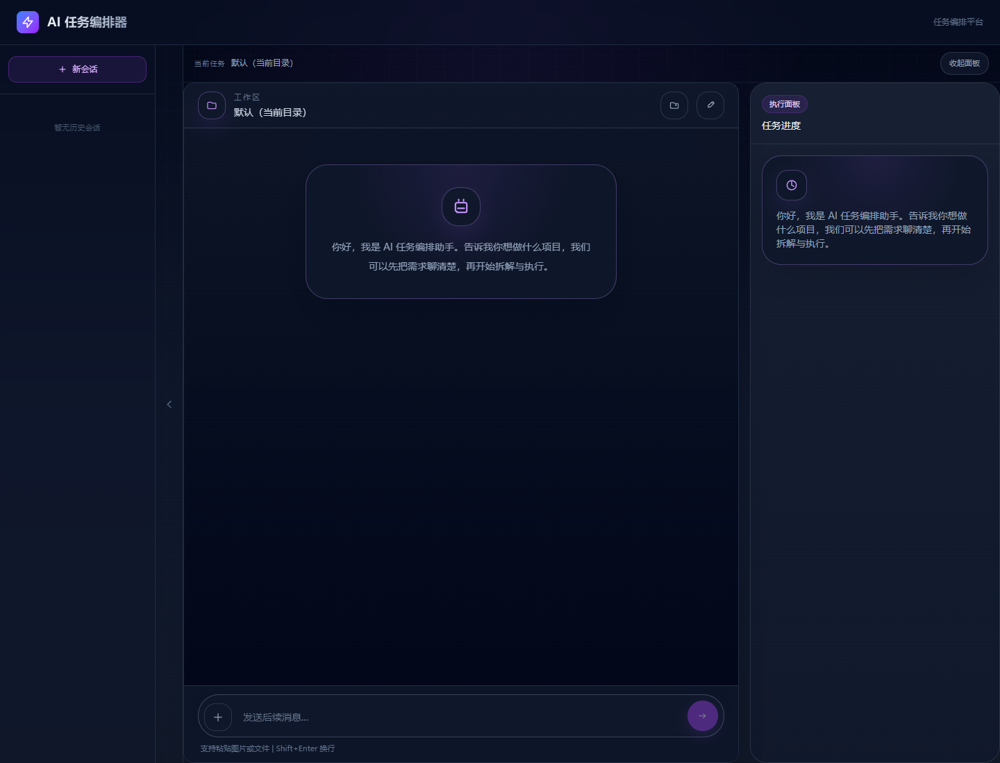
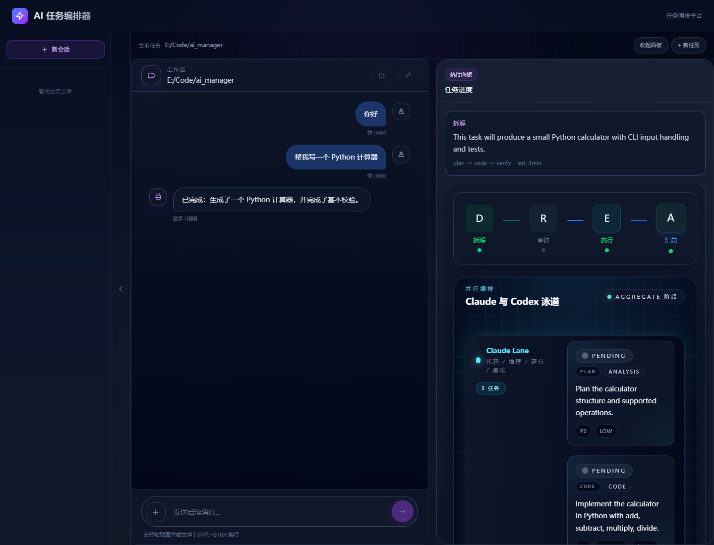
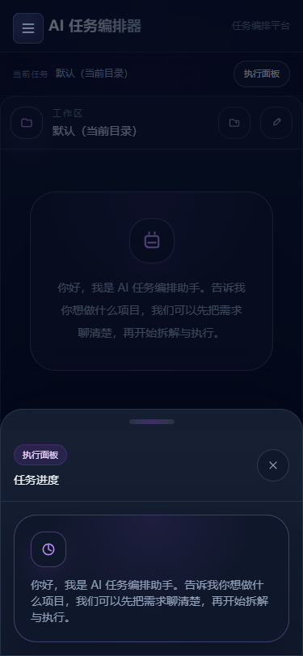

# AI Manager for Codex & Claude

AI 任务编排平台 — 以对话方式启动，Claude 主代理与你讨论需求后，**仅在用户明确确认时才拆解执行**。代码任务交给 Claude Code，分析/研究交给 Claude API，读图/生图交给 Codex CLI，前端实时展示泳道式进度。

## 效果预览

### 桌面端聊天首页



暗色三栏布局包含会话历史、聊天工作区和可折叠执行面板。用户可以先讨论需求，再明确确认执行。

### 任务拆解与执行泳道



执行面板实时展示拆解、审核、执行、汇总阶段，以及 Claude/Codex 子任务泳道、状态、日志和最终回复。

### 移动端执行抽屉

<p align="center">
  
</p>

移动端采用底部上滑执行抽屉，并保留固定输入区、文件上传和安全区适配。

> 预览图由项目 Playwright 用户流程生成，任务内容为稳定的演示数据。

## 架构

```
用户 → 聊天界面 (ChatFirst) → POST /api/tasks (chat-first)
                                    ↓
                              主代理对话 (chatFirstPhase)
                              ↓ 用户点「开始任务」或发确认关键词
                              Orchestrator (编排引擎)
                              ├── Decomposer (Claude Opus 拆解，60s 超时)
                              ├── Executors (并行执行)
                              │   ├── Claude Code CLI (代码, 指定工作目录)
                              │   ├── Claude API (分析/设计/研究/集成)
                              │   └── Codex CLI (读图/生图, 指定工作目录)
                              └── Aggregator (结果聚合)
                                    ↓
                              主代理在聊天中流式汇报结果
                                    ↓
                              用户反馈 → 继续讨论（不自动拆解）
                                    ↓
                              用户再次确认 → 重新拆解执行 (循环)
```

## 交互流程

```
首页聊天 ──→ 讨论需求 ──→ 点击「开始任务」或发确认关键词 ──→ 拆解 + 执行 ──→ 代理汇报 ──→ 反馈循环
    ↑                                                                                │
    └────────────────────────────────────────────────────────────────────────────────┘
```

1. 打开首页直接进入聊天界面，支持：
   - 文本输入 + **粘贴图片/文件**
   - **拖拽文件上传**、文件选择器、移动端拍照
   - 图片灯箱预览（Esc 关闭、焦点陷阱）
2. 与 AI 主代理讨论项目需求（可**指定项目文件夹**用于 Claude Code/Codex 执行）
3. 需求明确后 **点击「开始任务」或输入确认关键词**（"开始执行"/"开始拆解"/"开始吧"/"execute"等），AI 才拆解执行
4. 执行进度以流水线 + 子任务面板形式在右侧执行面板中展示
5. 完成后 AI 在聊天中流式汇报结果
6. 用户可继续对话反馈，但**系统不会自动重新拆解**——必须再次确认

## 项目结构

```
ai_manager/
├── shared/          # 前后端共享 Zod 类型定义
│   └── src/schemas/ # Subtask, TaskDecomposition, FileAttachment, SSEEvent
├── server/          # Express + TypeScript 后端
│   └── src/
│       ├── routes/
│       │   ├── tasks.ts         # REST API 路由
│       │   └── uploads.ts       # 文件上传（魔数检测、路径遍历防护、分层大小限制）
│       ├── services/
│       │   ├── orchestrator.ts    # 编排引擎 (状态机 + DAG 并行 + 重试 + 流式超时保护)
│       │   ├── decomposer.ts      # Claude 任务拆解 (含输出归一化 + 60s 超时)
│       │   ├── executor-claude.ts # Claude API 流式执行器
│       │   ├── executor-claude-code.ts # Claude Code CLI 代码执行器
│       │   ├── executor-codex.ts  # Codex CLI 子进程执行器 (JSON mode)
│       │   └── aggregator.ts      # 结果聚合
│       ├── sse/manager.ts         # SSE 连接管理 + 断线重播
│       ├── store/
│       │   ├── session-store.ts   # 会话存储 (内存 + 文件持久化 + 原子状态转换)
│       │   └── attachment-store.ts # 附件生命周期管理 + 孤儿清理
│       └── utils/                 # 重试 / 超时 / 日志 / 成本追踪
├── web/             # React 19 + Vite + Tailwind CSS 4 前端
│   └── src/
│       ├── pages/
│       │   ├── ChatFirst.tsx       # 聊天优先首页 (默认，桌面端固定高度 + 右面板)
│       │   ├── TaskSubmit.tsx      # 传统表单提交 (/submit)
│       │   └── TaskProgress.tsx   # 任务进度 + 对话侧边栏
│       ├── components/
│       │   ├── pipeline/   # SwimLane / PipelineView / SubtaskList / LogDrawer
│       │   ├── chat/       # ChatPanel / ChatMessage / ChatInput / ChatMessageList / WorkspaceSelector / FilePreview
│       │   ├── task/       # TaskForm / DecompositionReview
│       │   ├── stats/      # CostPanel / TimePanel
│       │   └── common/     # StatusBadge
│       ├── hooks/useSSE.ts # SSE 连接 + 断线重连 + 流式清理
│       ├── store/          # Zustand 状态管理 (pipeline / session / upload / theme)
│       ├── api/
│       │   ├── client.ts   # REST API 客户端
│       │   └── upload.ts   # 文件上传客户端（可重试 + 指数退避 + AbortController）
│       └── i18n.ts         # 中英文翻译
└── tsconfig.base.json
```

## 功能

### 核心引擎

- **确认门控**: AI 不会自动拆解——必须点击「开始任务」或发确认关键词（"开始执行" / "execute" 等）
- **流式超时保护**: 20s 空闲超时 + 60s 总超时，部分响应也会投递，不会让用户干等
- **智能拆解**: Claude Opus 4.8 分析任务，JSON Schema 结构化输出子任务，内置 LLM 输出归一化 + 60s 超时
- **并行执行**: DAG 依赖解析，最大 5 并发，Claude Code CLI + Claude API + Codex CLI 多引擎，失败自动重试（最多 3 次）
- **职责路由**: 代码固定交给 Claude Code；读图/生图固定交给 Codex，且视觉任务失败时不会静默回退 Claude

### 文件与图片

- **文件上传**: 支持图片/PDF/文本/代码文件，粘贴、拖拽、文件选择器三种方式
- **图片预览**: 上传即预览、灯箱放大（Esc 关闭、焦点陷阱）、移动端拍照上传
- **文件链接**: AI 输出中的文件路径自动渲染为可点击超链接
- **Markdown 图片**: AI 回复中的 `` 语法自动渲染为内联图片
- **安全**: 魔数检测（file-type）替代信任 MIME、分层大小限制、路径遍历防护、上传专用限流

### UI/UX

- **桌面端布局**: `max-w-5xl` 居中，左侧聊天面板 + 右侧 344px 可折叠执行面板，固定高度独立滚动
- **移动端**: 单列全宽，执行面板为底部上滑抽屉，sticky 输入区带 safe-area
- **暗色主题**: CSS 变量体系 (`--chat-bg` / `--panel-bg` / `--accent` 等)，紫色强调色
- **动画**: Framer Motion 消息入场 + 灯箱过渡，尊重 `prefers-reduced-motion`
- **可访问性**: ARIA 角色标注 (`role="status"` / `aria-live`)、键盘导航、焦点陷阱

### 工程

- **附件生命周期**: 独立状态机 (`uploading → ready`)，消息通过 `attachmentIds` 引用，24h 孤儿清理
- **上传队列**: Zustand store 管理，可暂存（无 session 时）、可重试、可取消
- **SSE 重连**: 指数退避（最多 10 次），事件历史重播，心跳保持
- **原子状态转换**: `tryTransitionStatus` CAS 防并发
- **生产保障**: 限流（上传端点独立限制）、pino 日志、优雅关闭、AbortSignal 传播

## 从零开始部署

下面分别介绍本地开发部署和正式生产部署。第一次使用建议先完成“本地开发部署”，确认 Claude、Codex 和代理都能正常工作后，再配置生产环境。

### 1. 准备运行环境

需要安装：

- **Git**：用于下载项目。
- **Node.js 22 LTS**：项目使用 npm workspaces，建议配套 npm 10 或更高版本。
- **Claude Code CLI**：代码子任务会通过它实际读写工作区。
- **Codex CLI 0.143+**：读图和生图子任务使用它执行。
- **CCSwitch 或兼容 Anthropic API 的代理**：默认地址为 `http://127.0.0.1:15721`。
- **Microsoft Edge 或 Playwright 浏览器**：仅运行 E2E 测试时需要。

安装完成后打开 PowerShell、Terminal 或其他命令行，检查版本：

```bash
git --version
node --version
npm --version
claude --version
codex --version
```

如果 `claude` 或 `codex` 提示“找不到命令”，请重新打开终端，并确认 CLI 所在目录已加入 `PATH`。

### 2. 下载项目

如果已经在本项目目录中，可以跳过本步骤。

```bash
git clone <你的仓库地址> ai_manager
cd ai_manager
```

后续所有命令都应在包含根目录 `package.json` 的 `ai_manager` 目录中执行。

### 3. 安装项目依赖

首次安装建议使用锁文件进行可重复安装：

```bash
npm ci
```

如果正在修改依赖或 `npm ci` 提示锁文件不一致，可改用：

```bash
npm install
```

根目录是 npm workspace，以上命令会同时安装 `shared`、`server` 和 `web` 的依赖，不需要逐个目录安装。

### 4. 配置 Claude、Codex 和模型代理

先复制环境变量模板。

Windows PowerShell：

```powershell
Copy-Item .env.example .env
```

macOS/Linux：

```bash
cp .env.example .env
```

打开 `.env`，最小配置如下：

```dotenv
LANGUAGE=zh

# CCSwitch 或兼容 Anthropic API 的代理
ANTHROPIC_BASE_URL=http://127.0.0.1:15721
ANTHROPIC_AUTH_TOKEN=PROXY_MANAGED

# 对话、拆解、分析和 Claude Code 使用的模型
DECOMPOSER_MODEL=claude-opus-4-8
EXECUTOR_MODEL=claude-sonnet-5

# CLI 路径
CLAUDE_CODE_CLI_PATH=claude
CODEX_CLI_PATH=codex

# 单机部署建议仅监听本机
HOST=127.0.0.1
PORT=3001
```

说明：

- 默认配置假设 CCSwitch 已在本机 15721 端口运行，并能识别上述模型名。
- 如果使用官方 Anthropic API，请把 `ANTHROPIC_BASE_URL`、认证令牌和模型名改为服务商实际配置；不要提交包含真实密钥的 `.env`。
- `CODEX_MODEL` 默认不设置，此时沿用 `~/.codex/config.toml` 中的本机 Codex 模型。
- 代码任务使用 Claude Code CLI；请确保它在当前终端中可运行并已完成认证或代理配置。
- 读图/生图使用 Codex CLI；请先按 Codex CLI 的认证方式完成登录。可以运行 `codex --version` 验证程序存在，并用一个独立的简单任务验证账户可用。
- 生图还要求当前 Codex 环境实际提供 imagegen 能力；否则视觉生成子任务会明确失败，不会静默改由 Claude 执行。

### 5. 启动 CCSwitch 或模型代理

先启动 CCSwitch，再检查端口是否可访问。Windows PowerShell 示例：

```powershell
Test-NetConnection 127.0.0.1 -Port 15721
```

看到 `TcpTestSucceeded : True` 后再启动本项目。如果使用其他代理地址，请同步修改 `.env` 中的 `ANTHROPIC_BASE_URL`。

### 6. 本地开发部署

一条命令同时启动后端和前端：

```bash
npm run dev
```

默认地址：

- 聊天首页：<http://localhost:5173>
- 传统提交页：<http://localhost:5173/submit>
- 后端健康检查：<http://127.0.0.1:3001/health>

健康检查应返回类似内容：

```json
{
  "status": "ok"
}
```

Vite 会把开发环境中的 `/api` 请求代理到 `http://localhost:3001`。不要只启动前端，否则会话、上传和 SSE 请求都会失败。

也可以分别启动，便于排查日志：

```bash
npm run dev:server
npm run dev:web
```

请在两个独立终端中执行以上命令。

### 7. 第一次功能验证

1. 打开 <http://localhost:5173>。
2. 选择一个允许 Claude Code/Codex 修改的测试工作目录，不要直接选择包含重要文件的目录。
3. 输入一个简单需求，例如“在测试目录创建一个 hello.txt，并写入 Hello”。
4. 与主代理确认需求后，点击“开始任务”或输入“开始执行”。
5. 确认顶部状态、耗时计时器和 Claude/Codex 泳道持续更新。
6. 完成后检查工作目录和页面交付文件区域。

建议第一次不要直接测试大型 DOCX、生图或长时间任务，先确认基础代码落盘链路正常。

### 8. 运行自动化验证

```bash
# server + web 单元/组件测试
npm test

# 生产构建
npm run build

# 浏览器 E2E；配置会自动启动 Vite
npm run test:e2e
```

E2E 默认使用本机 Microsoft Edge。如果 CI 或服务器没有 Edge，可安装 Playwright Chromium，并在 `tests/e2e/playwright.config.ts` 中移除或调整 `channel: 'msedge'`：

```bash
npx playwright install chromium
```

### 9. 正式生产部署

先生成后端和前端产物：

```bash
npm ci
npm run build
```

构建结果：

- 后端：`server/dist/`
- 前端：`web/dist/`

启动后端：

```bash
npm start -w server
```

当前 Express 服务只提供 API，不直接托管 `web/dist`。生产环境需要使用 Nginx、Caddy 或其他静态服务器发布前端，并将 `/api` 代理到后端。下面是一个最小 Nginx 示例：

```nginx
server {
    listen 80;
    server_name example.com;

    root /opt/ai_manager/web/dist;
    index index.html;

    location / {
        try_files $uri $uri/ /index.html;
    }

    location /api/ {
        proxy_pass http://127.0.0.1:3001;
        proxy_http_version 1.1;
        proxy_set_header Host $host;
        proxy_set_header X-Real-IP $remote_addr;

        # SSE 必须关闭代理缓冲并保持长连接
        proxy_buffering off;
        proxy_cache off;
        proxy_read_timeout 3600s;
        proxy_set_header Connection '';
    }

    location = /health {
        proxy_pass http://127.0.0.1:3001/health;
    }
}
```

将 `/opt/ai_manager` 和 `example.com` 替换为真实路径和域名。公网部署还应配置 HTTPS、身份认证、防火墙和允许访问的工作目录。

后端进程建议交给 systemd、PM2、Docker Compose 或其他进程管理器维护。无论使用哪种方式，都必须：

- 设置工作目录为项目的 `server` workspace 或确保数据路径可写。
- 持久化 `server/data/` 与 `server/uploads/`。
- 确保运行用户能调用 `claude`、`codex`，并能访问被授权的工作目录。
- 不要以管理员/root 身份执行不可信用户提交的任务。

### 10. 数据目录与备份

- 会话数据：`server/data/sessions.json`
- 上传及导入的交付文件：`server/uploads/`
- 生产构建：`server/dist/`、`web/dist/`，可随时重新生成，无需备份

停止服务后再备份数据目录，可避免复制到写入一半的 JSON。附件索引当前主要保存在运行时内存中，因此服务重启后应特别检查历史附件可用性。

### 11. 常见问题

#### 页面可以打开，但所有 API 都失败

- 确认后端 3001 端口正在监听。
- 开发环境确认使用 `npm run dev`，而不是只运行 Vite。
- 生产环境确认 Nginx/Caddy 已把 `/api` 代理到 3001。

#### `AI 服务响应超时` 或拆解一直不动

- 检查 CCSwitch/代理是否运行。
- 检查 `.env` 中的 URL、令牌和模型名。
- 直接访问 `/health` 只能证明后端运行，不代表模型代理一定可用。

#### 代码任务只返回文本，没有修改文件

- 运行 `claude --version`。
- 确认 `CLAUDE_CODE_CLI_PATH` 正确。
- 确认所选工作目录存在，且启动服务的用户有写权限。
- 查看服务端日志中是否出现 `Executing code subtask via Claude Code CLI`。

#### Codex 读不到图片或无法生图

- 运行 `codex --version` 并检查认证状态。
- 确认任务被拆成 `vision` 或 `image_generation` 类型。
- 确认上传图片状态为 `ready`。
- 生图需要 Codex 环境提供 imagegen 能力；本项目不会在 Codex 失败后改由 Claude 生图。

#### E2E 提示找不到浏览器

```bash
npx playwright install chromium
```

如果仍使用 `channel: 'msedge'`，还需要安装 Microsoft Edge，或者修改 Playwright 配置使用 Chromium。

#### 端口被占用

- 后端端口可通过 `.env` 中的 `PORT` 修改。
- 前端端口在 `web/vite.config.ts` 中配置。
- 修改后端端口后，还需要同步调整 Vite 代理和生产反向代理。

### 12. 安全提醒

本项目可以启动 Claude Code 和 Codex 修改指定工作目录，权限等同于运行服务的操作系统用户。默认接口没有完整的多用户身份认证，不应直接暴露到不可信公网。

单机使用建议：

```dotenv
HOST=127.0.0.1
```

团队或公网使用至少应增加：身份认证、HTTPS、工作目录白名单、最小权限运行账户、网络隔离、操作审计和资源限额。

## 命令

```bash
npm run dev          # 启动开发服务器 (server:3001 + web:5173)
npm test             # 运行全部 41 项测试 (22 server + 19 web)
npm run test:server  # 仅运行服务端测试
npm run test:web     # 仅运行前端测试
npm run test:e2e     # 运行 Playwright E2E 测试
npm run build        # 生产构建 (server + web)
```

## API

| Method | Path | Description |
|--------|------|-------------|
| POST | `/api/tasks` | 提交任务（支持 `chat-first` / `auto` / `semi-auto` 模式 + `workspaceDir` + `deferInitialMessage`） |
| GET | `/api/tasks/:id` | 查询任务状态 + 对话历史 + 附件 + 成本统计 + 工作目录 |
| POST | `/api/tasks/:id/approve` | 半自动模式确认拆解 |
| POST | `/api/tasks/:id/cancel` | 取消任务（终止进程） |
| POST | `/api/sessions/:id/message` | 发送跟进消息（可带 attachmentIds） |
| POST | `/api/sessions/:id/reconstruct` | 重新规划未完成的子任务 |
| POST | `/api/sessions/:id/confirm` | 确认需求，触发拆解执行（聊天优先唯一入口） |
| POST | `/api/sessions/:id/workspace` | 更新项目工作目录 |
| POST | `/api/uploads` | 上传文件（multipart，10MB 限制，Magic Number 检测） |
| GET | `/api/uploads/:storageKey` | 获取已上传文件 |
| GET | `/api/sessions/:id/stream` | SSE 实时进度流 |

## 任务生命周期

```
CHATTING ──→ (用户确认) ──→ DECOMPOSING ──→ EXECUTING ──→ AGGREGATING ──→ COMPLETED
    ↑                                                                           │
    └── 用户发消息 (回到 chatting，继续对话) ←───────────────────────────────────┘
```

子任务状态: `pending → queued → running → completed / failed / timed_out / cancelled`

## SSE 事件类型

| 事件 | 说明 |
|------|------|
| `session:created` | 会话已创建 |
| `stage:started` / `stage:completed` | 阶段状态变更 |
| `stage:awaiting_review` | 半自动模式等待审核 |
| `subtask:started` / `subtask:queued` / `subtask:progress` / `subtask:completed` / `subtask:failed` / `subtask:timed_out` | 子任务状态流 |
| `message:chunk` | AI 对话流式输出片段 |
| `message:complete` | AI 对话消息完成（含 role、timestamp、可选 attachmentIds） |
| `attachment:updated` | 附件状态更新 |
| `session:complete` / `session:error` | 会话完成 / 错误 |
| `cost:update` | 成本更新 |
| `heartbeat` | 心跳（15s） |

## 环境变量

| 变量 | 默认值 | 说明 |
|------|--------|------|
| `ANTHROPIC_BASE_URL` | `http://127.0.0.1:15721` | CCSwitch 代理地址 |
| `ANTHROPIC_AUTH_TOKEN` | `PROXY_MANAGED` | CCSwitch 认证令牌 |
| `DECOMPOSER_MODEL` | `claude-opus-4-8` | 拆解模型 |
| `EXECUTOR_MODEL` | `claude-sonnet-5` | 执行 + 对话模型 |
| `CLAUDE_CODE_CLI_PATH` | `claude` | Claude Code CLI 路径（代码任务） |
| `CLAUDE_CODE_TIMEOUT_MS` | `600000` | Claude Code 单个代码任务超时（ms） |
| `CODEX_CLI_PATH` | `codex` | Codex CLI 路径 |
| `CODEX_MODEL` | 未设置（沿用本机 Codex 配置） | 可选：覆盖 Codex CLI 使用的模型 |
| `CODEX_TIMEOUT_MS` | `300000` | Codex 执行超时 (ms) |
| `MAX_CONCURRENT_SUBTASKS` | `5` | 最大并行子任务数 |
| `MAX_RETRIES` | `3` | 子任务失败最大重试次数 |
| `TASK_TIMEOUT_MS` | `1800000` | 任务整体超时 (ms) |
| `PORT` | `3001` | 服务端口 |
| `LANGUAGE` | `zh` | 界面语言 (zh / en) |

## 技术栈

| 层 | 技术 |
|---|------|
| 后端 | Node.js + TypeScript + Express 5 + multer |
| AI | @anthropic-ai/sdk (Opus 4.8 / Sonnet 5 via CCSwitch) |
| Codex | Codex CLI 0.143+ (JSON mode, `--cd` workspace) |
| 前端 | React 19 + Vite + Tailwind CSS 4 |
| 状态 | Zustand 5 |
| 动画 | Framer Motion 12 |
| 实时 | Server-Sent Events (SSE) |
| 文件检测 | file-type (Magic Number) |
| 测试 | Vitest + Testing Library |
| 日志 | pino |
| 持久化 | JSON 文件 (data/sessions.json)，上传文件 (server/uploads/)，24h 自动清理 |

## 验证命令

```bash
npx tsc --noEmit -p server/tsconfig.json   # 服务端类型检查
npx tsc --noEmit -p web/tsconfig.json      # 前端类型检查
npx vite build --config web/vite.config.ts  # 生产构建
npm test                                    # 全部测试 (41)
```

## 最近更新

| 提交 | 说明 |
|------|------|
| `1f57206` | 确认门控、流式超时保护、文件超链接、内联图片渲染 |
| `3898e6d` | 终态消息回到 chatting 模式，不再自动拆解 |
| `d5c0df3` | 桌面端加宽至 max-w-5xl，固定高度聊天面板，独立滚动 |
| `129db42` | 延迟会话创建、暂存上传、异步发送、内存清理 |
| `512a2dc` | UI 润色、焦点陷阱、灯箱修复、CSS 变量体系 |
| `cb2de9f` | 整体 UI 重新设计：暗色主题、CSS 变量、Framer Motion |
| `600a65b` | 文件/图片上传 + 粘贴支持 + 附件基础设施 |

## License

MIT
